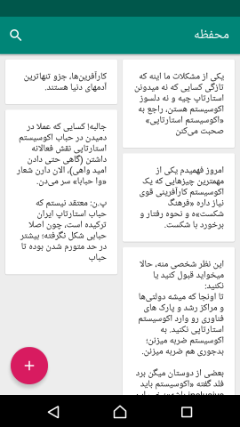
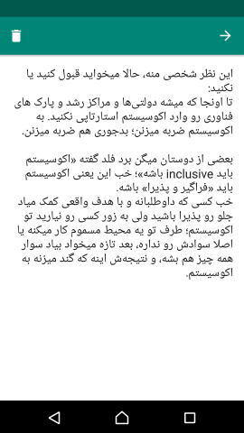

# Mahfaze Android App

Mahfaze is a super simple note-taking app with the ability to synchronize notes between all clients on all platforms.

## Screenshots

## Pre-requisites

- Android Studio 3.2 RC 3
- Android SDK Platform 28
- Kotlin 1.2.70

## Libraries used

- [Android Jetpack](https://developer.android.com/jetpack/)
  - Foundation
    - [AppCompat](https://developer.android.com/topic/libraries/support-library/packages.html#v7-appcompat)
    - [Android KTX](https://developer.android.com/kotlin/ktx.html)
  - Architecture
    - [Data Binding](https://developer.android.com/topic/libraries/data-binding/)
    - [Lifecycles](https://developer.android.com/topic/libraries/architecture/lifecycle)
    - [LiveData](https://developer.android.com/topic/libraries/architecture/livedata)
    - [Navigation](https://developer.android.com/topic/libraries/architecture/navigation.html)
    - [Room](https://developer.android.com/topic/libraries/architecture/room)
    - [ViewModel](https://developer.android.com/topic/libraries/architecture/viewmodel)
    - [WorkManager](https://developer.android.com/topic/libraries/architecture/workmanager)
  - UI
    - [Fragment](https://developer.android.com/guide/components/fragments)
    - [Layout](https://developer.android.com/guide/topics/ui/declaring-layout)
- [Material Components](https://github.com/material-components/material-components-android)
- [Dagger 2](https://github.com/google/dagger)
- [Gson](https://github.com/google/gson)
- [Retrofit](https://github.com/square/retrofit)
- [ThreeTenABP](https://github.com/JakeWharton/ThreeTenABP)
